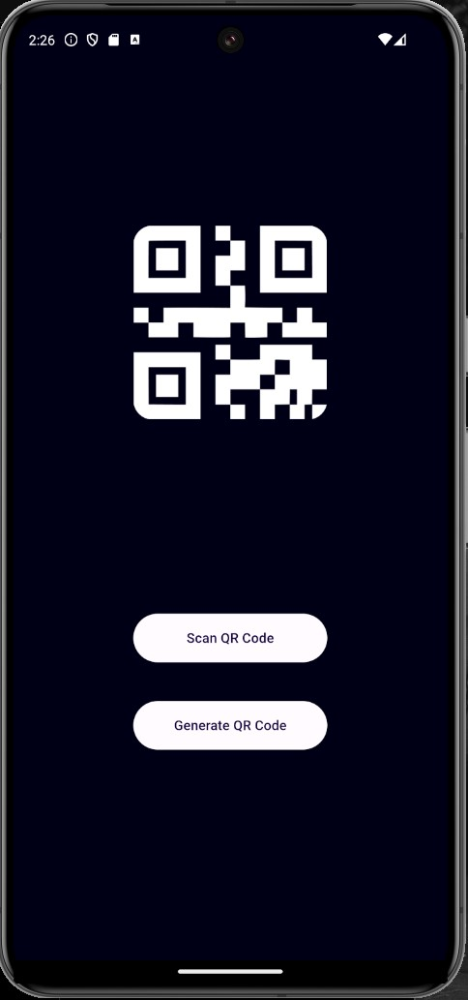
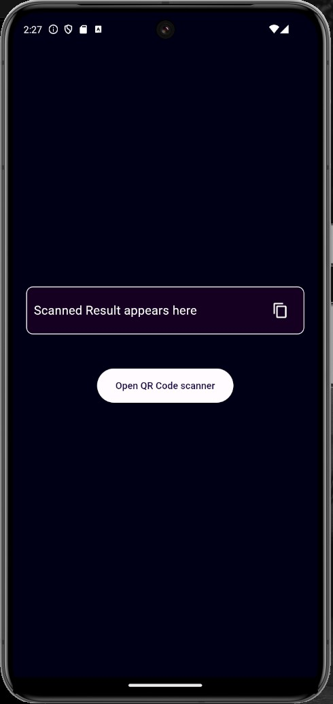
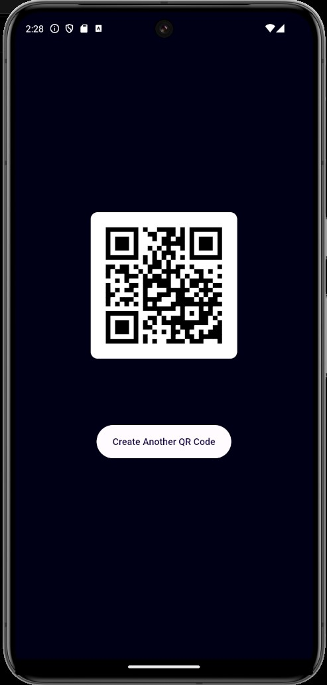

# QR Code Scanner and Generator


## Table of Contents
- [Overview](#overview)
- [Features](#features)
- [Screenshots](#screenshots)
- [Installation](#installation)
- [Usage](#usage)
- [Dependencies](#dependencies)

## Overview

QR Code Scanner and Generator is a Flutter application that allows users to scan and generate QR codes with ease. This app uses `qr_flutter` for generating QR codes and `flutter_barcode_scanner` for scanning QR codes.

## Features

- **Scan QR Codes:** Quickly scan any QR code and display the result.
- **Generate QR Codes:** Create QR codes from any text input.
- **Copy to Clipboard:** Easily copy the scanned or generated QR code data to the clipboard.
- **User-friendly Interface:** Simple and intuitive UI for a seamless experience.

## Screenshots

Here are some screenshots of the app in action:

### Home Screen


### QR Code Scanner


### QR Code Generator


## Installation

To get started with the QR Code Scanner and Generator app, follow these steps:

1. **Clone the repository:**
   ```sh
   git clone https://github.com/yourusername/qrcode_scanner_generator.git
   cd qrcode_scanner_generator

2. **Install dependencies:**
   ```sh
   flutter pub get

3. **Install dependencies:**
   ```sh
   flutter run

## Usage

**Scan a QR Code**: Tap the "Open QR Code Scanner" button to start scanning. Point your camera at the QR code to scan it. The result will be displayed on the screen.

**Generate a QR Code**: Enter text into the input field and tap the "Generate QR Code" button. The generated QR code will be displayed on the screen.

   
